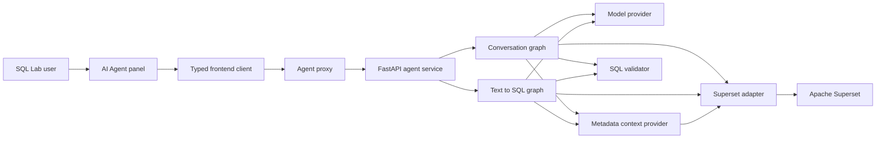
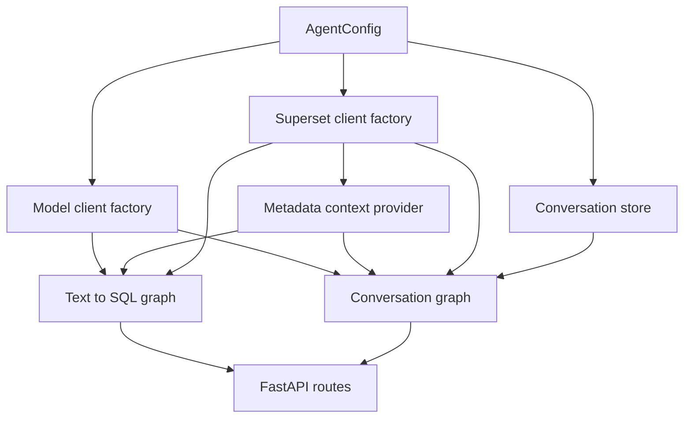
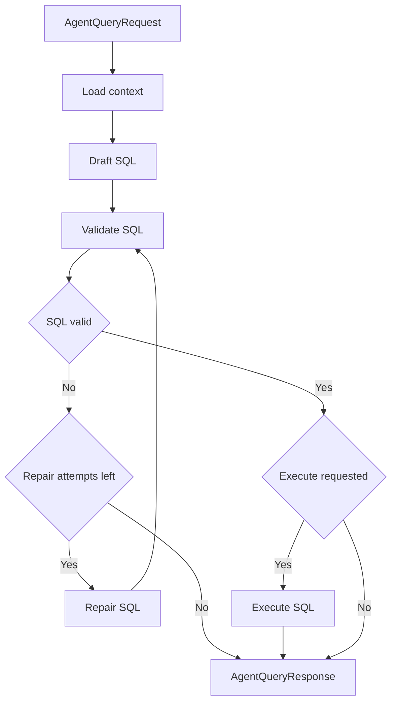
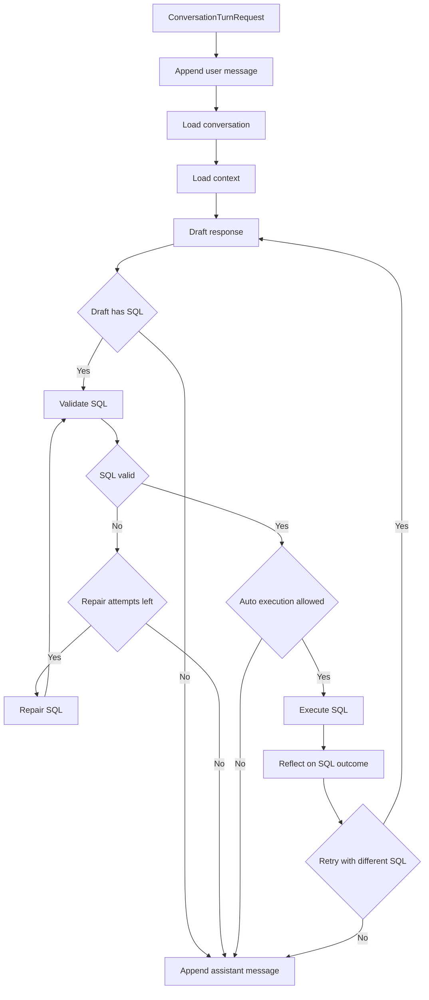

<!--
Licensed to the Apache Software Foundation (ASF) under one or more
contributor license agreements.  See the NOTICE file distributed with
this work for additional information regarding copyright ownership.
The ASF licenses this file to You under the Apache License, Version 2.0
(the "License"); you may not use this file except in compliance with
the License.  You may obtain a copy of the License at

   http://www.apache.org/licenses/LICENSE-2.0

Unless required by applicable law or agreed to in writing, software
distributed under the License is distributed on an "AS IS" BASIS,
WITHOUT WARRANTIES OR CONDITIONS OF ANY KIND, either express or implied.
See the License for the specific language governing permissions and
limitations under the License.
-->

# Superset AI Agent Architecture

This document maps the standalone `superset_ai_agent` proof of concept to the
files that implement it, the Superset APIs it can call, and the extension points
that matter most for SQL quality and agent robustness.

The shortest rule for contributors is: keep graph logic provider-neutral, keep
Superset transport details inside `integrations/superset`, and keep SQL safety
checks in `tools/sql.py` enforceable without trusting the model prompt.

## Runtime Topology



The standalone agent exposes a FastAPI API. SQL Lab uses it through
`/ai-agent` by default. In local Docker/dev-server runs, webpack rewrites
`/ai-agent/*` to the agent service; nginx also has a `/ai-agent/` location that
forwards to the same service.

## Auth And Request Scope

The normal SQL Lab integration uses the logged-in Superset browser session for
agent identity and Superset API calls:

1. The frontend client calls `/ai-agent` with `credentials: "include"`.
2. Nginx or the webpack dev proxy forwards the browser `Cookie`,
   `Authorization`, and CSRF headers to the standalone agent.
3. `SupersetSessionIdentityProvider` validates the request with Superset
   `GET /api/v1/me/` and scopes persisted agent state by the Superset user id.
4. `SupersetRestClient` and `SupersetMcpClient` receive a
   `SupersetRequestAuth` object and forward only that request's browser
   credentials to Superset.

This is configured with:

```env
AI_AGENT_IDENTITY_PROVIDER=superset_session
SUPERSET_AUTH_MODE=user_session
```

Service-account mode still exists for direct native API tests and explicitly
non-user-scoped deployments. It should be treated as a separate product mode:
the agent can then see whatever the configured service account can see, not
what the current browser user can see.

## Startup Assembly

`superset_ai_agent/app.py` is the composition root:



`create_app()` accepts injected config, model client, graphs, and conversation
store, so tests can replace external services without changing route code.

## File Map

### Agent Core

| File | Component | Responsibility |
| --- | --- | --- |
| `superset_ai_agent/app.py` | FastAPI app factory and routes | Wires config, model client, Superset adapter, context provider, graphs, conversation store, CORS, and HTTP error handling. |
| `superset_ai_agent/auth.py` | Identity providers and request auth | Resolves static, signed-header, or Superset-session identities and captures per-request browser credentials for Superset REST/MCP calls. |
| `superset_ai_agent/config.py` | `AgentConfig` | Reads all runtime env vars for model provider, Superset adapter, SQL limits, conversation behavior, CORS, and logging. |
| `superset_ai_agent/graph.py` | `TextToSqlGraph`, `SqlDraft` | One-shot natural language to SQL workflow used by `POST /agent/query`. |
| `superset_ai_agent/conversation_graph.py` | `ConversationGraph`, `ConversationDraft` | Multi-turn assistant workflow with chat history, execution modes, SQL observations, repair loop, and artifacts. |
| `superset_ai_agent/schemas.py` | API Pydantic models | Request/response contracts for one-shot queries, SQL validation, model listing, health, trace events, and execution results. |
| `superset_ai_agent/tools/sql.py` | SQL validation utilities | Parses with `sqlglot`, blocks DDL/DML keywords/expressions, limits statements to one read-only query, and appends a default limit. |

### Conversations

| File | Component | Responsibility |
| --- | --- | --- |
| `superset_ai_agent/conversations/schemas.py` | `Conversation`, `ConversationScope`, `ConversationMessage`, `ConversationArtifact` | Persisted chat contract, active SQL Lab scope, generated SQL artifacts, execution modes, and turn responses. |
| `superset_ai_agent/conversations/store.py` | `ConversationStore` protocol | Storage boundary for conversation CRUD and artifact replacement after SQL execution. |
| `superset_ai_agent/conversations/memory.py` | `InMemoryConversationStore` | Process-local store used by the current POC and tests. |

### Context And Prompts

| File | Component | Responsibility |
| --- | --- | --- |
| `superset_ai_agent/context/base.py` | `ContextProvider` protocol | Narrow contract for metadata/RAG providers. |
| `superset_ai_agent/context/superset_metadata.py` | `SupersetMetadataContextProvider` | Builds prompt context by calling `SupersetClient.get_agent_context()`. |
| `superset_ai_agent/context/rag_stub.py` | RAG placeholder | Placeholder for future retrieval-augmented context. |
| `superset_ai_agent/prompts/registry.py` | `get_prompt(name)` | File-backed prompt loader with caching. |
| `superset_ai_agent/prompts/text_to_sql.md` | Text-to-SQL system prompt | Rules for one-shot SQL generation. |
| `superset_ai_agent/prompts/conversation.md` | Conversation system prompt | Rules for multi-turn answers, SQL generation, execution-mode behavior, and result observations. |

### Superset Integration Boundary

| File | Component | Responsibility |
| --- | --- | --- |
| `superset_ai_agent/integrations/superset/client.py` | `SupersetClient` protocol, normalized metadata models, `LocalSupersetClient` | Stable handoff API used by graphs. The local adapter imports Superset in process for development. |
| `superset_ai_agent/integrations/superset/factory.py` | `create_superset_client()` | Selects `local`, `rest`, or `mcp` from `SUPERSET_AGENT_ADAPTER`. |
| `superset_ai_agent/integrations/superset/rest.py` | `SupersetRestClient` | Authenticated REST adapter for database/dataset metadata and SQL Lab execution. |
| `superset_ai_agent/integrations/superset/mcp.py` | `SupersetMcpClient` | MCP JSON-RPC adapter for database/dataset metadata and SQL execution tools. |
| `superset_ai_agent/integrations/superset/README.md` | Adapter notes | Detailed payload examples and low-level adapter controls. |

### LLM Providers

| File | Component | Responsibility |
| --- | --- | --- |
| `superset_ai_agent/llm/base.py` | `ModelClient`, `ChatMessage`, `ModelResult` | Provider-neutral model interface used by both graphs. |
| `superset_ai_agent/llm/factory.py` | `create_model_client()` | Selects provider from `AI_AGENT_MODEL_PROVIDER`. |
| `superset_ai_agent/llm/ollama.py` | `OllamaModelClient` | Local Ollama chat/model listing integration. |
| `superset_ai_agent/llm/openai_client.py` | `OpenAIModelClient` | OpenAI API integration. |
| `superset_ai_agent/llm/openai_compatible.py` | `OpenAICompatibleModelClient` | OpenAI-compatible gateway integration. |
| `superset_ai_agent/llm/azure_openai.py` | `AzureOpenAIModelClient` | Azure OpenAI deployment integration. |
| `superset_ai_agent/llm/schema.py` | Structured-output helpers | Provider helpers for JSON schema / JSON object / prompt-only structured output. |

### SQL Lab UI And Deployment

| File | Component | Responsibility |
| --- | --- | --- |
| `superset-frontend/src/SqlLab/components/AiAgentPanel/index.tsx` | SQL Lab AI panel | Reads active SQL Lab tab context, manages conversation history, sends turns, renders SQL artifacts, and can insert generated SQL into the editor. |
| `superset-frontend/src/SqlLab/components/AiAgentPanel/api.ts` | Browser API client | Typed fetch wrappers for all standalone agent routes. Default base URL is `/ai-agent`. |
| `superset-frontend/src/SqlLab/components/AiAgentPanel/*.test.*` | Frontend tests | Coverage for API URL handling and panel behavior. |
| `superset-frontend/webpack.config.js` | Dev proxy | Rewrites `/ai-agent/*` to `SUPERSET_AI_AGENT_PROXY` or `http://127.0.0.1:8097`. |
| `docker-compose.ai-agent.yml` | Compose extension | Adds `superset-ai-agent`, sets SQL Lab frontend env vars, and wires nginx to the agent. |
| `docker-compose.no-bind.yml` | Compose extension | Used by the Windows PowerShell helper to run the AI smoke stack without host bind mounts. Shares webpack assets through the `superset_static_assets` named volume. |
| `docker/nginx/templates/superset.conf.template` | Nginx route | Proxies `/ai-agent/` to `SUPERSET_AI_AGENT_UPSTREAM`. |
| `docker/Dockerfile.ai-agent` | Agent image | Installs `requirements-ai-agent.txt` and runs the standalone service. |
| `superset_ai_agent/.env.example` | Agent env template | Shared model provider, Superset adapter, limits, logging, and CORS defaults for native and Docker runs. Docker Compose overrides only container-network topology. |
| `scripts/docker-compose-ai-up.sh` and `.ps1` | Dev helpers | Allocate the public site port, validate agent env, and start the Superset plus AI stack. |

## Agent Graphs

### One-Shot Text-To-SQL

`POST /agent/query` calls `TextToSqlGraph.run()`.



Status behavior:

| Condition | Response status |
| --- | --- |
| Valid SQL and no execution requested | `needs_review` |
| Valid SQL and execution result returned | `ok` |
| Validation failed after repair attempts | `error` |

### Conversational Agent

`POST /agent/conversations/{conversation_id}/messages` calls
`ConversationGraph.run()`. `POST
/agent/conversations/{conversation_id}/execute-sql` wraps a reviewed SQL
artifact as `approved_sql`, skips the initial model draft, validates the SQL,
executes only that approved statement in `manual` mode, replaces the original
artifact with validation and result state, and then appends only the final
assistant answer after reflecting on the execution observation. If reflection
asks for another query in manual mode, the assistant appends a new SQL artifact
for user approval instead of executing it automatically.



Execution modes are defined in `conversations/schemas.py`:

| Mode | Behavior |
| --- | --- |
| `manual` | Produce a validated SQL artifact for user review; do not execute automatically. |
| `read_only` | Execute only if `tools/sql.py` validates the query as read-only. |
| `auto` | Same backend safety gate as `read_only`; intended for a more permissive UI policy. |

`AI_AGENT_MAX_SQL_ITERATIONS` caps automatic SQL execution and reflection
cycles. The reflection prompt chooses whether to answer, retry with feedback for
the SQL drafting prompt, or explain missing requirements. The graph skips
duplicate SQL attempts within a turn before calling Superset. Prompts only see
`AI_AGENT_MAX_PROMPT_RESULT_ROWS` rows per execution observation.

## Standalone Agent API

These routes are served by `superset_ai_agent/app.py`, typically on host port
`8097` for native development, container port `5050` in Docker, and through
`/ai-agent` from nginx on the Docker site port.

| Method | Path | Request model | Response model | Purpose |
| --- | --- | --- | --- | --- |
| `GET` | `/health` | none | `HealthResponse` | Agent and model-provider reachability. |
| `GET` | `/models` | none | `list[ModelInfo]` | Available models for the active provider when supported. |
| `POST` | `/agent/query` | `AgentQueryRequest` | `AgentQueryResponse` | One-shot text-to-SQL generation, validation, and optional execution. |
| `POST` | `/agent/validate-sql` | `ValidateSqlRequest` | `SqlValidation` | SQL-only validation without model or Superset metadata calls. |
| `POST` | `/agent/conversations` | `ConversationCreateRequest` | `Conversation` | Start a scoped conversation. |
| `GET` | `/agent/conversations` | none | `list[ConversationSummary]` | List conversation history for the current owner. |
| `GET` | `/agent/conversations/{conversation_id}` | none | `Conversation` | Fetch a full transcript. |
| `POST` | `/agent/conversations/{conversation_id}/messages` | `ConversationTurnRequest` | `ConversationTurnResponse` | Append a user message and run one agent turn. |
| `POST` | `/agent/conversations/{conversation_id}/execute-sql` | `ConversationSqlExecutionRequest` | `ConversationTurnResponse` | Execute a reviewed SQL artifact, update that artifact with returned rows, and append the follow-up answer. |
| `DELETE` | `/agent/conversations/{conversation_id}` | none | `{ "deleted": true }` | Delete a conversation. |

The frontend typed client for all of these routes is
`superset-frontend/src/SqlLab/components/AiAgentPanel/api.ts`.

## Superset Client Contract

Graphs call only the `SupersetClient` protocol in
`integrations/superset/client.py`.

| Method | Used by | Purpose |
| --- | --- | --- |
| `list_databases()` | Custom tools/tests | List visible databases. |
| `list_datasets(database_id, dataset_ids, limit)` | Context construction | Return dataset metadata with columns and metrics. |
| `get_agent_context(database_id, dataset_ids)` | `SupersetMetadataContextProvider` | Return compact `AgentContext` for prompts. |
| `get_database_dialect(database_id)` | SQL validation nodes | Map Superset backend to a `sqlglot` dialect hint. |
| `execute_sql(database_id, sql, schema_name, limit)` | Execution nodes | Execute validated SQL and normalize rows/columns/count. |

Adapter selection:

| `SUPERSET_AGENT_ADAPTER` | Class | Transport | Best use |
| --- | --- | --- | --- |
| `local` | `LocalSupersetClient` | In-process Superset imports and ORM calls | Fast local development. It bypasses REST/MCP transport behavior and should not be the production security model. |
| `rest` | `SupersetRestClient` | Superset REST API | Production-shaped user-session or service-account integration. |
| `mcp` | `SupersetMcpClient` | Superset MCP JSON-RPC tools | Agent-native integration with request-scoped auth, tool discovery, and MCP RBAC middleware. |

## Superset REST Surface Used By The Agent

`SupersetRestClient` calls these Superset endpoints when
`SUPERSET_AGENT_ADAPTER=rest`.

| Operation | Superset endpoint | Agent method |
| --- | --- | --- |
| Login with username/password | `POST /api/v1/security/login` | `_ensure_authenticated()` |
| Fetch CSRF token for mutating requests | `GET /api/v1/security/csrf_token/` | `_ensure_csrf_token()` |
| List databases | `GET /api/v1/database/` | `list_databases_raw()` |
| Get one database | `GET /api/v1/database/{database_id}` | `get_database_raw()` |
| List datasets for a database | `GET /api/v1/dataset/` | `list_datasets_raw()` |
| Get dataset details | `GET /api/v1/dataset/{dataset_id}` | `get_dataset_raw()` |
| Execute SQL through SQL Lab | `POST /api/v1/sqllab/execute/` | `execute_sql_raw()` |
| Poll SQL Lab result key | `GET /api/v1/sqllab/results/` | `get_sqllab_results_raw()` |

REST authentication modes:

| Env vars | Behavior |
| --- | --- |
| `SUPERSET_AUTH_MODE=user_session` | Forwards the current inbound browser `Cookie`, `Authorization`, and CSRF headers to Superset. No service token, username/password, or copied CSRF token is required. |
| `SUPERSET_AUTH_MODE=service_account`, `SUPERSET_AUTH_TOKEN` | Sends `Authorization: Bearer <token>`. |
| `SUPERSET_AUTH_MODE=service_account`, `SUPERSET_USERNAME`, `SUPERSET_PASSWORD`, `SUPERSET_AUTH_PROVIDER` | Logs in through `/api/v1/security/login` and stores the returned access token in memory. |
| `SUPERSET_CSRF_TOKEN` | Service-account override for a pre-issued CSRF token. Leave empty for normal REST use so the adapter fetches CSRF and keeps the matching session cookie in its HTTP client. |
| No service-account auth env vars | Sends no auth header in service-account mode, for deployments where identity is injected upstream. |

## Superset MCP Surface Used By The Agent

`SupersetMcpClient` posts JSON-RPC to `SUPERSET_MCP_URL`, defaulting to
`http://localhost:8098/mcp`.

Low-level JSON-RPC methods exposed by the adapter:

| Method | JSON-RPC method | Purpose |
| --- | --- | --- |
| `list_tools()` | `tools/list` | Discover MCP tools and schemas. |
| `call_tool(name, arguments)` | `tools/call` | Invoke a Superset MCP tool and unwrap the content payload. |
| `get_tool_schema(name)` | `tools/list` | Return one tool input schema. |
| `read_resource(uri)` | `resources/read` | Read a Superset MCP resource when available. |

MCP tools called by the high-level agent adapter:

| MCP tool | Agent method | Purpose |
| --- | --- | --- |
| `list_databases` | `list_databases_raw()` | Discover databases with selected columns. |
| `get_database_info` | `get_database_raw()`, `get_database_dialect()` | Get backend/dialect and database metadata. |
| `list_datasets` | `list_datasets_raw()` | Discover datasets for a database. |
| `get_dataset_info` | `get_dataset_raw()` | Get dataset columns and metrics for prompt context. |
| `execute_sql` | `execute_sql_raw()` | Execute validated SQL with database, schema, limit, timeout, and cache flags. |

MCP auth:

| Env vars | Behavior |
| --- | --- |
| `SUPERSET_AUTH_MODE=user_session` | Forwards the current inbound browser `Cookie` and `Authorization` headers to the MCP endpoint. |
| `SUPERSET_MCP_AUTH_TOKEN` | Sends `Authorization: Bearer <token>` to the MCP endpoint. |
| `SUPERSET_AUTH_TOKEN` | Fallback token when `SUPERSET_MCP_AUTH_TOKEN` is unset. |
| Neither set in service-account mode | Sends no auth header, for upstream identity injection. |

The Superset MCP service tool implementations live under
`superset/mcp_service/*/tool/*.py`. Useful tools for future agent work include:

| Category | Tool files | Typical use |
| --- | --- | --- |
| Database | `database/tool/list_databases.py`, `database/tool/get_database_info.py` | Database discovery and dialect/backend hints. |
| Dataset | `dataset/tool/list_datasets.py`, `dataset/tool/get_dataset_info.py`, `dataset/tool/query_dataset.py` | Dataset context, semantic metadata, direct dataset querying. |
| SQL Lab | `sql_lab/tool/execute_sql.py`, `sql_lab/tool/save_sql_query.py`, `sql_lab/tool/open_sql_lab_with_context.py` | SQL execution and SQL Lab workflow handoff. |
| Chart | `chart/tool/get_chart_sql.py`, `chart/tool/get_chart_data.py`, `chart/tool/get_chart_info.py`, `chart/tool/get_chart_type_schema.py` | Reusing chart SQL/data as grounding context or generating chart-ready follow-ups. |
| Query and saved query | `query/tool/*.py`, `saved_query/tool/*.py` | Query history and saved SQL context. |
| Explore/dashboard | `explore/tool/generate_explore_link.py`, `dashboard/tool/*.py` | Moving from generated SQL/results into Superset exploration assets. |
| System | `system/tool/health_check.py`, `system/tool/get_instance_info.py`, `system/tool/get_schema.py` | Health, capability discovery, and model/schema inspection. |
| RLS/security metadata | `rls/tool/*.py` | Inspect row-level security filters when the caller has permission. |

MCP RBAC and error behavior are handled in `superset/mcp_service/auth.py` and
`superset/mcp_service/middleware.py`. SQL execution tools require SQL Lab
execution permissions, so an agent using MCP should run under an identity whose
capabilities match the intended product behavior.

## Data Contracts That Shape Prompt Quality

### Prompt Context

`AgentContext` from `integrations/superset/client.py` is the context passed to
the model:

```text
AgentContext
  database: DatabaseSummary(id, name, backend)
  datasets: list[DatasetMetadata]
    id, table_name, schema_name, database_id, description
    columns: list[ColumnSummary(name, type, is_dttm, description)]
    metrics: list[MetricSummary(name, expression, description)]
```

The model is told to use only these tables, columns, and metrics. If SQL quality
is poor because the model lacks business meaning, improve this contract or the
context provider before adding graph complexity.

### SQL Artifact

`ConversationArtifact` stores generated SQL with:

```text
type = "sql"
sql
explanation
validation: SqlValidation
execution_result: ExecutionResult | None
trace: list[TraceEvent]
```

Artifacts are included in follow-up prompts through `_conversation_payload()` so
the model can revise or explain prior SQL.

### Validation Result

`SqlValidation` includes:

```text
is_valid
is_read_only
normalized_sql
dialect
errors
```

Validation errors are fed back to the model in repair nodes. This makes error
message quality important: specific validator errors produce better repairs.

## SQL Safety And Quality Controls

The backend does not rely on the prompt alone. The enforcement stack is:

1. Prompts in `prompts/text_to_sql.md` and `prompts/conversation.md` instruct
   the model to produce one read-only query and use only provided context.
2. Structured-output schemas (`SqlDraft`, `ConversationDraft`) require the model
   to return JSON with explicit SQL/explanation fields.
3. `tools/sql.py` strips trailing semicolons, checks forbidden keywords, parses
   with `sqlglot`, rejects multiple statements, rejects destructive AST nodes,
   allows only `SELECT`, `UNION`, or `WITH` roots, and appends a default limit.
4. Graph repair nodes ask the model to fix validator failures up to
   `AI_AGENT_MAX_REPAIR_ATTEMPTS`.
5. Execution nodes call Superset only when validation passes and the selected
   execution policy permits it.
6. Result rows returned to the prompt are capped by
   `AI_AGENT_MAX_PROMPT_RESULT_ROWS`.

Important caveat: `ensure_limit()` currently checks for any `LIMIT` token in the
SQL text. If you broaden SQL support to nested queries, dialect-specific top-N
syntax, or comments, improve this with AST-aware limit detection.

## Where To Modify Behavior

| Goal | Primary files | Notes |
| --- | --- | --- |
| Improve generated SQL style | `prompts/text_to_sql.md`, `prompts/conversation.md`, `graph.py`, `conversation_graph.py` | Start with prompt payload and examples. Keep hard safety rules in Python. |
| Improve SQL validation | `tools/sql.py`, `schemas.py`, tests around `/agent/validate-sql` | Add dialect-specific parsing, AST checks, table allowlists, better limit handling, and clearer repair errors. |
| Improve schema grounding | `context/superset_metadata.py`, `integrations/superset/client.py`, `rest.py`, `mcp.py` | Add richer metadata to `AgentContext` only when it helps the prompt choose valid columns/joins/metrics. |
| Add retrieval/RAG | `context/base.py`, `context/rag_stub.py`, new context provider | Keep the graph using `ContextProvider`; avoid importing vector-store details into graph nodes. |
| Change automatic execution policy | `conversation_graph.py`, `conversations/schemas.py`, `config.py` | `_can_execute_sql()` is the policy gate for conversation execution. |
| Add durable conversation storage | `conversations/store.py`, new store implementation, `app.py` factory | Implement the protocol without changing graph behavior. |
| Add another model provider | `llm/base.py`, `llm/factory.py`, new provider file, `config.py` | The provider must honor `format_schema` or emulate structured output robustly. |
| Use more Superset capabilities | `integrations/superset/mcp.py`, `integrations/superset/rest.py` | Add low-level calls inside adapters, then expose normalized methods if graphs need them. |
| Improve SQL Lab UX | `AiAgentPanel/index.tsx`, `AiAgentPanel/api.ts` | Keep browser calls pointed at the standalone agent, not directly at Superset internals. |

## Configuration Reference

| Env var | Default | Purpose |
| --- | --- | --- |
| `AI_AGENT_MODEL_PROVIDER` | `ollama` | One of `ollama`, `openai`, `openai_compatible`, `azure_openai`. |
| `AI_AGENT_MODEL` | `qwen2.5-coder:7b` | Ollama model name. |
| `OLLAMA_BASE_URL` | `http://localhost:11434` | Ollama endpoint. |
| `OPENAI_API_KEY`, `OPENAI_BASE_URL`, `OPENAI_MODEL` | provider defaults | OpenAI configuration. |
| `OPENAI_COMPATIBLE_API_KEY`, `OPENAI_COMPATIBLE_BASE_URL`, `OPENAI_COMPATIBLE_MODEL` | unset | OpenAI-compatible gateway configuration. |
| `OPENAI_COMPATIBLE_STRUCTURED_OUTPUT` | `json_schema` | Structured-output mode for compatible providers. |
| `AZURE_OPENAI_ENDPOINT`, `AZURE_OPENAI_KEY`, `AZURE_OPENAI_MODEL` | unset | Azure OpenAI configuration. |
| `AZURE_OPENAI_API_VERSION` | `2024-02-15-preview` | Azure API version. |
| `AI_AGENT_DEFAULT_SQL_LIMIT` | `1000` | Limit appended to valid SQL without an explicit limit. |
| `AI_AGENT_MAX_REPAIR_ATTEMPTS` | `1` | SQL repair retries after validation failure. |
| `AI_AGENT_MAX_CONTEXT_DATASETS` | `8` | Max datasets fetched when no explicit dataset IDs are supplied. |
| `AI_AGENT_CONVERSATION_STORE` | `memory` | Conversation store backend. |
| `AI_AGENT_MAX_HISTORY_MESSAGES` | `12` | Conversation messages included in prompt history. |
| `AI_AGENT_MAX_PROMPT_RESULT_ROWS` | `5` | Execution rows included in follow-up prompt observations. |
| `AI_AGENT_MAX_SQL_ITERATIONS` | `3` | Max automatic execute/reflect/retry cycles per turn. |
| `AI_AGENT_IDENTITY_PROVIDER` | `superset_session` in `.env.example` | Owner identity for persisted state: `superset_session`, `signed_header`, or `static`. |
| `SUPERSET_AGENT_ADAPTER` | `rest` | One of `local`, `rest`, `mcp`. |
| `SUPERSET_AUTH_MODE` | `user_session` in `.env.example` | `user_session` forwards the logged-in browser user's Superset credentials. `service_account` uses token or username/password credentials. |
| `SUPERSET_BASE_URL` | `http://localhost:8091` | Superset REST base URL for native development. Docker uses the internal service URL `http://superset:8088`. |
| `SUPERSET_MCP_URL` | `http://localhost:8098/mcp` | Superset MCP JSON-RPC URL. |
| `SUPERSET_AUTH_TOKEN`, `SUPERSET_USERNAME`, `SUPERSET_PASSWORD` | unset in `.env.example` | Service-account REST authentication options. Ignored when `SUPERSET_AUTH_MODE=user_session`. |
| `SUPERSET_MCP_AUTH_TOKEN` | falls back to `SUPERSET_AUTH_TOKEN` | MCP bearer token. |
| `SUPERSET_SQL_POLL_ATTEMPTS` | `10` | REST SQL Lab results polling attempts. |
| `SUPERSET_SQL_POLL_INTERVAL_SECONDS` | `0.5` | Delay between REST SQL Lab result polls. |
| `AI_AGENT_CORS_ALLOWED_ORIGINS` | local Superset/dev URLs | Browser origins allowed by FastAPI CORS. |
| `AI_AGENT_LOG_LEVEL` | `INFO` | Agent log level. |
| `AI_AGENT_SUPPRESS_SUPERSET_LOGS` | `true` | Quiets Superset logs in the agent process. |

## Development Checklist For SQL Robustness Work

1. Start by identifying whether the issue is prompt behavior, missing context,
   SQL validation, Superset transport normalization, or frontend workflow.
2. Add or adjust tests at the same boundary:
   `tools/sql.py` for validation, graph tests for routing/repair/execution,
   adapter tests for REST/MCP payload normalization, and panel tests for UI/API
   behavior.
3. Keep new graph nodes small and deterministic. Expensive or transport-specific
   work belongs behind `ContextProvider`, `SupersetClient`, or `ModelClient`.
4. Do not allow generated SQL to bypass the SQL safety policy
   (`tools/sql_policy.py`, surfaced via `validate_read_only_sql()`) before
   execution. Classification is delegated to Superset core's `SQLScript`; the
   execution tier decision lives in `sql_policy.decide()`. Only read-only SQL
   auto-runs, and human approval never promotes a non-read-only statement.
5. When adding Superset data to prompts, keep payloads compact and capped.
   Large schemas should be selected or retrieved, not blindly dumped.
6. Prefer MCP/REST adapters for permission-sensitive behavior. The local adapter
   is useful for development but does not exercise the same transport and auth
   paths.
7. Confirm `/agent/validate-sql`, `/agent/query`, and the conversation message
   route still return useful `trace` events; trace quality is the fastest way to
   debug agent failures from the UI.
